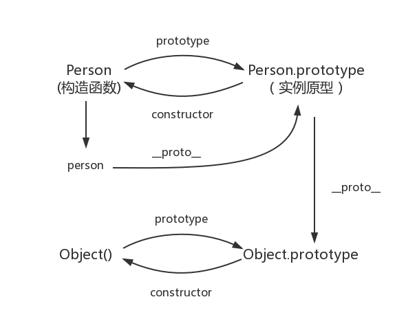

#### js基础之原型和原型链

js中使用了对象，为了保证对象之间的联系，引入了原型与原型链的概念。

---

先使用构造函数创建一个对象：

```
function Person() {

}
var person = new Person();
person.name = 'Kevin';
console.log(person.name) // Kevin
```

在这个demo中，Person就是一个构造函数，使用new创建了一个实例对象。


##### <font color="#dd0000">prototype（原型）</font>

---

js中每个函数都有一个prototype属性.

原型也是一个对象。

每一个对象都会从原型‘继承’属性

```
function Person() {

}
// prototype是函数才会有的属性
Person.prototype.name = 'Kevin';
var person1 = new Person();
var person2 = new Person();
console.log(person1.name) // Kevin
console.log(person2.name) // Kevin
```

函数的prototype属性指向了一个对象，这个对象正是调用该构造函数而创建实例的原型。就是以上demo中的“person1 和person2”

原型是每一个js对象（除null）在创建的时候就会与之关联另一个对象，这个对象就是我们所说的原型，每一个对象都会从原型继承属性。

关系图：


##### <font color="#dd0000">  __proto__(` __proto__`) </font>

---

每一个js对象（除null）都具有一个属性，叫` __proto__`，这个属性会指向该对象的原型。

```
function Person() {

}
var person = new Person();
console.log(person.__proto__ === Person.prototype); // true
```

关系图：


##### <font color="#dd0000"> constructor</font>

---

每个原型都有一个 constructor 属性指向关联的构造函数

```
function Person() {}
console.log(Person === Person.prototype.constructor); // true
```

关系图：


##### <font color="#dd0000"> 实例与原型</font>

---

当读取实例的属性时，如果找不到，就会查找与对象关联的原型中的属性，如果还查不到，就去找原型的原型，一直找到最顶层为止。


##### <font color="#dd0000"> 原型的原型</font>

---

```
var obj = new Object();
obj.name = 'Kevin'
console.log(obj.name) // Kevin
```
原型对象是通过 Object 构造函数生成的，结合之前所讲，实例的 __proto__ 指向构造函数的 prototype ,因为关系图为：




##### <font color="#dd0000"> 原型链</font>

原型链是一个由对象组成的有限对象链，用于实现继承和共享属性。

---


图中由相互关联的原型组成的链状结构就是原型链，也就是蓝色的这条线。


#### <font color="#dd0000">总结</font>

---

1. 每个构造函数都有一个prototype
2. 每一个对象都有一个`_proto_`属性指向函数的protptype
3. 每一个prototype都有一个constructor，指向构造函数
4. 函数的prototype也是对象，最终指向Object.prototype，构成原型链
5. object.prototype的`_proto`指向为null
6. 同一个构造函数实例的对象，共享prototype的属性和方法，即实现继承。
7. 构造函数的prototype属性与它创建的实例对象的`__proto__ `属性指向的是同一个对象，即 `对象.__proto__ === 函数.prototype `
8. 访问对象属性时，js会先从自身属性查找，如果没有查找到再跳转到原型对象的属性中查找。
9. 所有原型链的终点都是Objetc函数的prototype属性，因为在js中的对象默认都是Object（）构造的。


